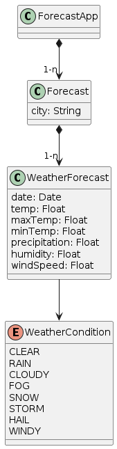

## Forecast App.

- Basic Forecast REST API made with NestJS framework. Allow an API consumer to retreive weather forecasts for a given city.

## Domain UML

- UML with main domain vocabulary.



## OpenAPI documentation

- Find openAPI documents on /api/v1/docs.

## Test coverage

- Run the test with jest:
    ```bash
    # Tests
    $ npx jest
    ```

## Running locally

- Copy `.env.example` file and rename to `.env`
- Install the packages: `npm install`
- Run the app:
    ```bash
    # development
    $ npm run start
     
    # watch mode
    $ npm run start:dev
      
    # production mode
    $ npm run start:prod
    ```

